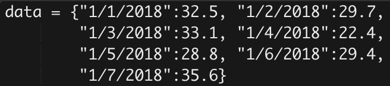

## Entry 1: Introduction

#### What is React.js?
React.js is a JavaScript Library for building user interfaces. A user interface is how a person interacts with a program. Therefore, in the MVC pattern this would be the view. Another JavaScript library that I am familiar with and have used before is p5js. The developers of this program are Facebook, Instagram, and other individuals. React.js was first released in March of 2013. The main reason why people use this is to provide speed and simplicity to large web-applications. This is due to the fact that React.js allows data to change over time without reloading the page. In other words, React will update and render data (UI/view) when it changes. This turns the JavaScript into

#### How it works!
###### Previous Method:
Dataset:

User Interface

#### Resources:
https://reactjs.org/

https://en.wikipedia.org/wiki/React_(JavaScript_library)

https://www.youtube.com/watch?v=JPT3bFIwJYA

https://www.youtube.com/watch?v=ycstRj2i66k
`v`