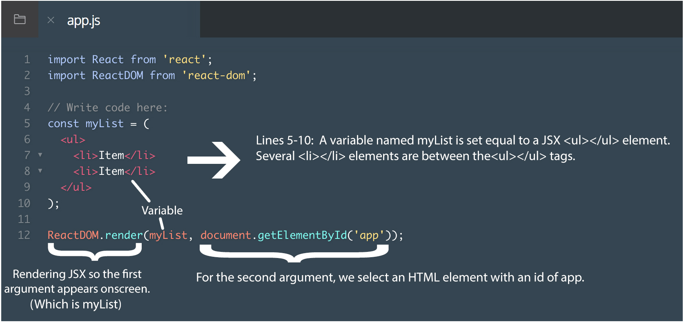

# Entry 3: Rendering JSX

## ReactJS Vocabulary
It is very important to get familiar with a new languages vocabulary. This is so that when you are reading forms or resources online, you understand what it saying, and when you google a problem you can use the terminology you know. In order to keep track of vocabulary I created my own documentation of it in a Google Doc. This was very useful to do because it made me look at this vocabulary again, and when I did not understand something I could refer to this. It is also a place where I store rules and other notes that might be helpful in the future.

## Rendering JSX
To render a JSX expression means to make it appear onscreen.
```
import React from 'react';
import ReactDOM from 'react-dom';

ReactDOM.render(<h1>Hello world</h1>, document.getElementById('app'));
```
This is the code that is needed to render JSX. But what does it mean?

`ReactDOM` is the name of a JavaScript library. This library contains several React-specific methods, all of which deal with the DOM in some way or another.

`ReactDOM.render()` is the most common way to render JSX. It makes its first argument appear onscreen. (also one of `ReactDOM`'s methods) It takes a JSX expression, creates a corresponding tree of DOM nodes, and adds that tree to the DOM. That is the way to make a JSX expression appear onscreen.

`<h1>Hello world</h1>`: This is the first argument being passed to `ReactDOM.render()`. `ReactDOM.render()`'s first argument should be a JSX expression, and it will be rendered to the screen.

`document.getElementById('app')`: This shows where on the screen should that first argument appear. So this could be in the HTML file, and the id of a div or container could be `app`.
#### Passing a Variable to `ReactDOM.render()`

credit: Codecademy ReactJS
Instead of having a block of text and code snippets to explain this one, I found out that an annotated picture is useful.

## Takeaways
I learned that it is very helpful to keep track of your learning by documenting it. I also find it useful to understand a new idea or concept I learned by portraying in in a diagram, or annotated picture. I have done this in the past and it is not only great to strengthen your understanding, but in the future this can be a quick reference to something you may have forgotten.

## Resources:
https://www.codecademy.com/courses/react-101