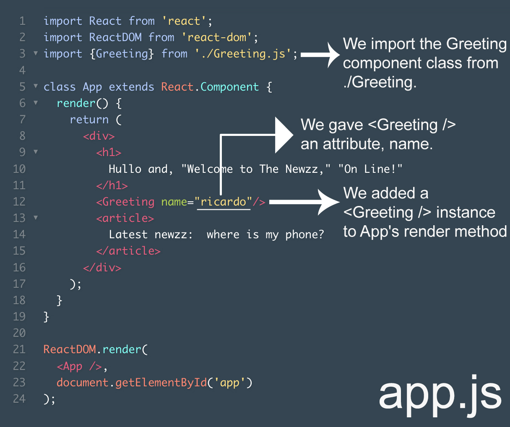
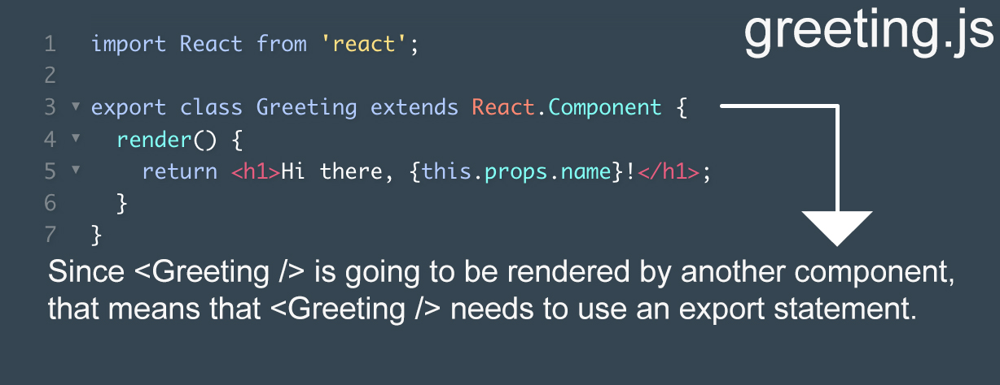

# Entry 5: this.props

## What is a prop?
As the Codecademy course comes to an end, one of the topics here is props in react JS. We know that a component can pass information to another component. Information that gets passed from one component to another is known as "props." props is the name of the object that stores passed-in information. this.props refers to that storage object. At the same time, each piece of passed-in information is called a prop. This means that props could refer to two pieces of passed-in information, or it could refer to the object that stores those pieces of information.

Every component has something called props. A component's props is an object. It holds information about that component. To see a component's props object, you use the expression this.props. Here's an example of this.props being used inside of a render method:
``` javascript
render() {
  console.log("Props object comin' up!");

  console.log(this.props);

  console.log("That was my props object!");

  return <h1>Hello world</h1>;
}
```

## How to pass `props` to a Component!
In order to pass information to a React component you have to give that component an attribute:
``` javascript
<MyComponent foo="bar" />
```
Let's say that you want to pass a component the message, "This is some top secret info.". Here's how you could do it:
``` javascript
<Example message="This is some top secret info." />
```
To pass information to a component, you need a name for the information that you want to pass. In the above example, we used the name message. You can use any name you want.

## Rendering a Component's props
You will often want a component to display the information that you pass. All you have to do is find the component class that is going to receive that information and then include `this.props.name-of-information` in that component class's render method's `return` statement.
``` javascript
class Greeting extends React.Component {
  render() {
    return <h1>Hi there, {this.props.firstName}!</h1>; // this is the class's render method's return statement!
  }
}

ReactDOM.render(
  <Greeting firstName='Ricardo' />, 
  document.getElementById('app')
);
```
This will render "Hi there, Ricardo!" on the screen.

## Pass props From Component To Component
The most common use of props is to pass information to a component, from a different component. Let's say you have one file, Greeting.js that has a class Greeting. You also have another file App.js. This file has various other information, however we want to input the result of Greeting.js in this file. We want to to pass a prop to a <Greeting /> component instance, from an <App /> component instance. This is how we would do it:


## Takeaways
During my learning process this week I found it very useful to keep track of my learning by keeping my notes updated. Not only do I have a place to keep my notes, but it is also very useful for my entries. This entry is pretty much all of the information I documented throughout the week. That way at the end of the week I don't have to dig through much resources or remember what I wanted to put in my blog entry. Link to my Google Doc:
https://docs.google.com/document/d/1lTAp4qC2NWLlWhCdMuiQrSZRcGZk1uqE0mILxqt83sY/edit?usp=sharing 