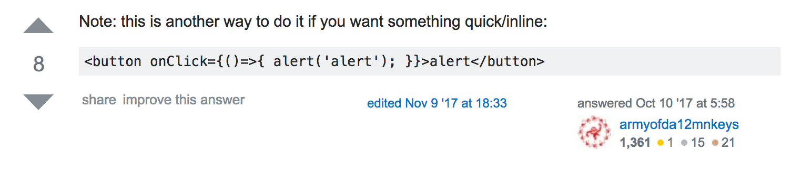

# Entry 8: Expo & MVP

## MVP and Collaberation
Now that I have learned a lot about ReactJS it is time to create something with my knowledge. At this point I did not know what to make, and then my teacher (Mr. Mueller) told me that a classmate, Kelly Xiong Chen had been working on cyber security. He insisted that since I had been working on a Javascript library, that it would be ideal to add content about cyber security. Now that I knew what to make, it was time to build! We decided that I should make a website that shows key details about cyber security such as signs and a simulation. There was several challenges that I faced when making my website. First off, I never made something with React. As odd as this sounds, I spent a long time learning about the components and the environment set-up. The down side to this was that I did not have any experience creating something, however when the time came I fully understood the vocabulary and how the app worked. Therefore I knew what the React DOM is, Babel, Webpack, and what NPM were. With this knowledge I was able to create my MVP and showed it off in the SEP Showcase in about 3-4 days of work. Another challenge I faced was setting up my workspace. At first I attempted to use Cloud 9, which in fact did not work. Most tutorials were based on a local setup. This means that you have to download what you need and it is saved in your computer. Then you can run it in your browser, however it is only there temporarily. Then, I attempted to follow a Codecademy tutorial on how to setup a local environment however it was outdated and their WEBPACK.CONFIG.JS file did not work. Finally I found a React Basic Template on Github from a YouTube tutorial. At this point I attempted to code my website here but ran into many problems, one of which was using and linking multiple pages. Then I learned about the React Router, which lets you route between different parts of your React app. This is a great way to use components and tie them into multiple pages in your website!

## JSX, HTML, and Javascript
While writing all of my code in JSX, and then letting Babel configure my code into regular Javascript, I ran into several errors. For instance, JSX is similar to HTML yet there are some syntax differences. Therefore what may be correct syntax in HTML will throw off babel and return an error when the development server is starting. In order to display the dangers of Cross-site Scripting I needed to show how a person can add unintentional prompts to a website. I needed to add what would be known as a alert prompt in regular Javascript however it didn’t work in my JSX file. I did some research on Google and found a Stack Overflow question with a similar concept as mine:

This works well however I do not need the user to press a button and then the prompt pops up! I thought to my self, no problem; when the user clicks the next link (which I could add the onClick attribute as so: 
``` javascript 
<Link to="/example3" id="link" onClick={()=>{ alert('alert'); }} >Next</Link>) 
``` 
then it would work. The issue with this was that it would pop up before it went to the next page, where I wanted it to be. To solve this I Googled more Javascript Events and found the OnLoad event, which execute immediately after a page has been loaded. I added this to the intentional page like so: 
``` javascript 
<div id="example3" onLoad={()=>{ alert('alert'); }}>
```
and it worked!

## Takeaways
One takeaway that i would have is that you should use the resources that you have in front of you. In my context I used a template that already had a basic react router setup. As long as you have attempted it and understand how the component works, it is a time saver and you can learn from it.